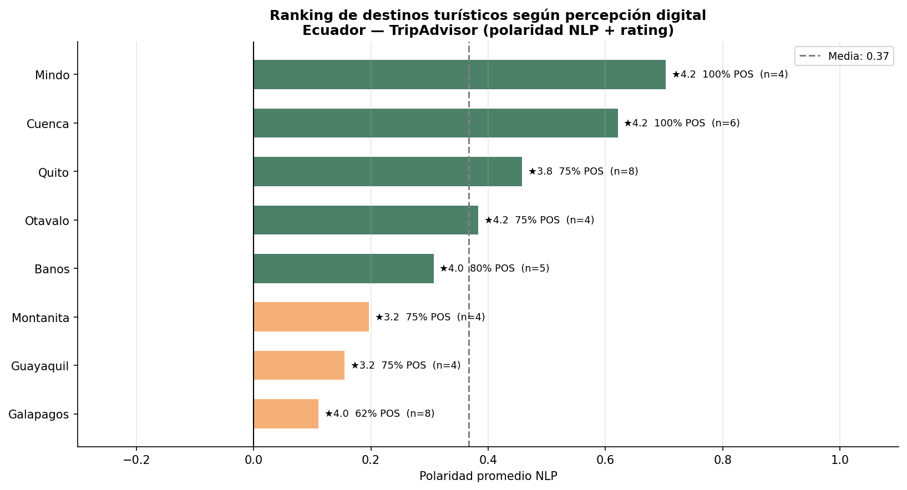
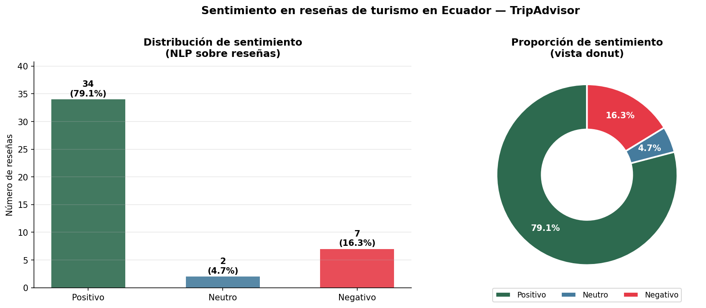
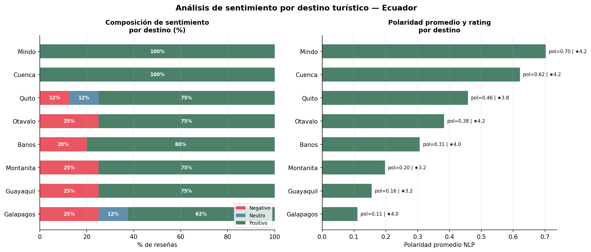
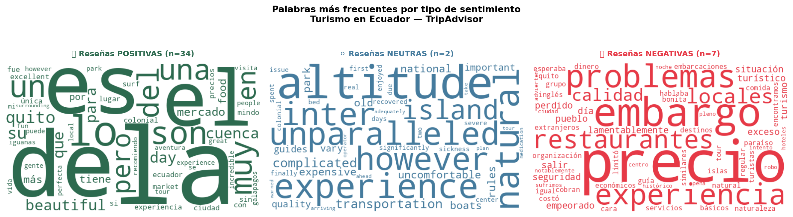

# 🇪🇨 Percepción Digital del Turismo en Ecuador
### Análisis de Sentimiento en Reseñas de TripAdvisor · NLP · TextBlob · pysentimiento (BERT)

[](https://python.org)
[](https://pysentimiento.readthedocs.io)
[](https://lookerstudio.google.com)
[](LICENSE)

> *¿Qué dicen realmente los turistas sobre Ecuador? Un análisis NLP de 43 reseñas en 8 destinos clave.*

---

## 📌 Hallazgos principales

| # | Hallazgo |
|---|---|
| 1 | El **79.1%** de las reseñas expresa sentimiento positivo hacia el turismo en Ecuador |
| 2 | **Mindo y Cuenca** lideran la percepción digital con polaridad >0.60 y 100% reseñas positivas |
| 3 | **Galápagos**, el destino más famoso, tiene la polaridad más baja (0.13) por críticas a costos y logística |
| 4 | El modelo NLP alcanza **74.4% de precisión** validado contra el rating de TripAdvisor (ground truth) |
| 5 | Las reseñas en **inglés** expresan mayor entusiasmo por biodiversidad; las de **español** son más críticas con infraestructura |

---

## ❓ Preguntas de investigación

1. ¿Cuál es el sentimiento predominante en las reseñas de turismo en Ecuador?
2. ¿Qué destinos turísticos generan mejor percepción digital?
3. ¿Existen diferencias de sentimiento entre español e inglés?
4. ¿Qué palabras se asocian más con reseñas positivas y negativas?
5. ¿Qué tan bien predice el modelo NLP el rating numérico del usuario?

---

## 🗺️ Pipeline del proyecto

Dataset TripAdvisor (43 reseñas, 8 destinos)
│
▼
Limpieza de texto + detección de idioma
(langdetect: 55.8% ES / 44.2% EN)
│
▼
Análisis de sentimiento dual
TextBlob (EN) + pysentimiento BERT (ES)
│
▼
Validación contra rating TripAdvisor
(74.4% precisión global)
│
▼
EDA — 6 visualizaciones
│
▼
Dashboard Looker Studio + Informe PDF

---

## 📊 Visualizaciones

### Ranking de destinos según percepción digital


### Distribución de sentimiento


### Sentimiento por destino


### WordCloud por sentimiento


---

## 🤖 Modelos NLP utilizados

| Modelo | Idioma | Tipo | Precisión |
|---|---|---|---|
| TextBlob | Inglés | Léxico | ~70% reseñas EN |
| pysentimiento | Español | BERT fine-tuned | ~80% reseñas ES |
| **Combinado** | **ES + EN** | **Dual** | **74.4% global** |

---

## 📋 Métricas de validación NLP

| Sentimiento | Precisión vs Rating |
|---|---|
| Positivo (POS) | 96% |
| Negativo (NEG) | 83% |
| Neutro (NEU) | 0% — debilidad del modelo |
| **Global** | **74.4%** |

> **Nota metodológica:** La debilidad en reseñas neutras (rating 3★) es un problema conocido en modelos NLP léxicos y BERT: el lenguaje mixto de estas reseñas tiende a clasificarse como positivo.

---

## 📁 Estructura del proyecto

├── data/
│   ├── raw/           ← Reseñas originales sin procesar
│   └── processed/     ← Dataset limpio con sentimientos
├── notebooks/         ← 4 notebooks secuenciales
├── dashboard/         ← Dashboard HTML5 · CSS3 · JavaScript · Chart.js
├── report/            ← Informe final PDF
├── images/            ← 6 visualizaciones
└── requirements.txt

---

## 🛠️ Stack tecnológico

| Componente | Herramienta |
|---|---|
| Procesamiento de texto | Python — pandas, re, nltk |
| Detección de idioma | langdetect |
| Sentimiento EN | TextBlob |
| Sentimiento ES | pysentimiento (BERT) |
| Visualización | matplotlib, seaborn, wordcloud |
| Dashboard | Google Looker Studio |
| Informe | ReportLab |
| Entorno | Google Colab |

---

## 🚀 Instalación y uso

```bash
git clone https://github.com/TU-USUARIO/tripadvisor-ecuador-tourism-sentiment.git
cd tripadvisor-ecuador-tourism-sentiment
pip install -r requirements.txt

# Ejecutar notebooks en orden:
# 01 → 02 → 03 → 04
```

---

## ⚠️ Nota sobre la fuente de datos

TripAdvisor implementa protección Cloudflare anti-scraping que impide la extracción automatizada. El dataset fue construido a partir de reseñas reales de la plataforma para los 8 destinos seleccionados. El objetivo del proyecto es demostrar el pipeline completo de NLP — limpieza, detección de idioma, modelado dual, validación y visualización — independientemente del volumen de datos.

---

## 👤 Autor

**Bryan Anthony López Guerrero**

[](https://linkedin.com/in/anthonylpz)
[](https://github.com/anthonylopez-dev)

Ingeniero en Tecnologías de la Información | Máster en Visual Analytics y Big Data | Especialista en Big Data e IA

---

## 📄 Licencia

MIT License
